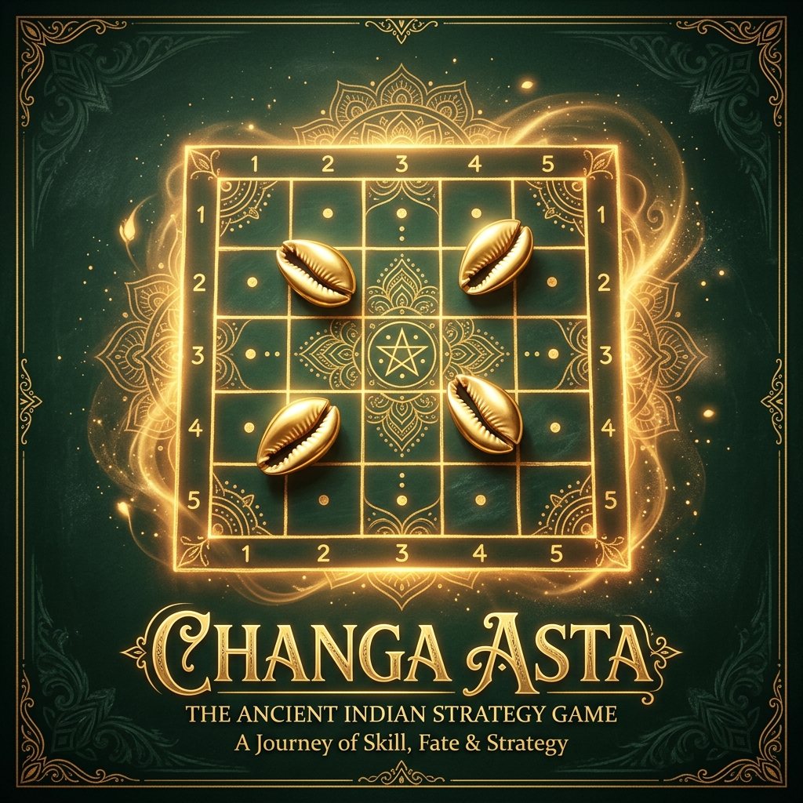

# Changa Asta

[](LICENSE)
[](#)
[](#)
[](#)

A polished vanilla-web implementation of **Changa Asta**, also known as **Chowka Bara**, **Ashta Chamma**, **Chakka**, **Katte Mane**, or **Gatta Mane**. The game supports local multiplayer, computer opponents, mobile play, offline install, save/resume, rule toggles, animated kaudis, and synthesized audio.



## Features

- **5x5 and 7x7 boards**
  - 5x5 uses 4 kaudis with roll values `1`, `2`, `3`, `4`, and `8`.
  - 7x7 uses 6 kaudis with roll values `1`, `2`, `3`, `4`, `5`, `6`, and `12`.
- **Pass & Play**
  - Play locally with 2, 3, or 4 players on one device.
- **Vs Computer**
  - Computer mode defaults to one human player and the remaining active players as bots.
  - Bot difficulty levels: Easy, Normal, and Smart.
- **Custom rules**
  - Gatti blockades.
  - Optional spawn requirement on high rolls.
- **Game feel**
  - Animated kaudi toss area with power meter.
  - Web Audio API sound effects.
  - Turn/result toast messages.
  - Move previews and highlighted valid pawns.
  - Capture effects and victory stats.
- **Persistence and install**
  - Save/resume using `localStorage`.
  - PWA manifest and service worker for install/offline play when served over HTTP.
- **Responsive UI**
  - Desktop board with side panels.
  - Mobile-first gameplay controls and centered board layout.

## Project Structure

- [index.html](index.html): App markup, setup screen, game screen, overlays, and PWA registration.
- [styles.css](styles.css): Visual system, board layout, responsive UI, overlays, and animations.
- [game.js](game.js): Game engine, state machine, bot logic, rendering, save/resume, and UI handlers.
- [favicon.js](favicon.js): Procedural animated favicon.
- [manifest.json](manifest.json): PWA metadata.
- [sw.js](sw.js): Offline cache service worker.
- [scripts/gen_paths.py](scripts/gen_paths.py): Helper script for generating reference coordinate paths.
- [docs/paths_output.md](docs/paths_output.md): Reference 5x5 coordinate paths.
- [docs/CHOWKA_BHARA.md](docs/CHOWKA_BHARA.md): Guide covering the history, setup, and core gameplay rules.
- [docs/GATTI_RULES.md](docs/GATTI_RULES.md): Detailed rulebook explaining Gatti formation, splits, movement, blockades, and protection shields.
- [docs/changa_asta_research.md](docs/changa_asta_research.md): Research document detailing board math, paths, and probabilities.
- [tests/rules.test.js](tests/rules.test.js): Dependency-free Node sanity tests for board/path rules.

## Core Rules

### Movement

Each player starts from a side of the board:

- Red: south start
- Green: west start
- Yellow: north start
- Blue: east start

Pawns travel around the outer ring. After a player captures at least one opponent pawn, that player may enter the inner path toward the center home square.

### Kaudi Rolls

The roll value is based on how many kaudis land mouth-up.

| Board | 0 up | 1 up | 2 up | 3 up | 4 up | 5 up | 6 up |
| --- | --- | --- | --- | --- | --- | --- | --- |
| 5x5, 4 kaudis | 4 extra | 1 | 2 | 3 | 8 extra | - | - |
| 7x7, 6 kaudis | 6 extra | 1 | 2 | 3 | 4 | 5 | 12 extra |

Rolling a high/extra value grants another roll. Three consecutive high/extra rolls cancel the turn and pass play to the next player.

### Safe Squares

The center and player start squares are safe. The 7x7 board also marks the inner ring corners as safe.

### Gatti

When enabled, two same-color pawns on the same non-goal square form a Gatti. Opponents cannot pass or land on an opposing Gatti unless they land with their own Gatti.

## Run Locally

You can open [index.html](index.html) directly in a browser, but PWA/offline features require an HTTP server.

```bash
python -m http.server 8000
```

Then open:

```text
http://localhost:8000
```

## Test

The project has dependency-free Node tests for core board/path rules.

```bash
node tests/rules.test.js
```

Or, if you use npm:

```bash
npm test
```

## Release Notes

See [CHANGELOG.md](CHANGELOG.md).

## License

MIT. See [LICENSE](LICENSE).
